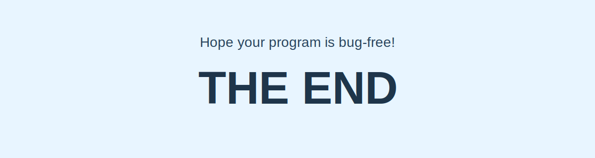

  

## 👋 About Me

- I am currently focused on AI agents, frontend engineering, and building practical side projects
- I like learning in public through code, notes, and small iterations
- I am exploring how ideas can become useful products and developer tools
- I am building steadily with Next.js, TypeScript, and modern web workflows

## 🌱 Current Focus

- AI agent workflows and experiments
- Frontend practice with React, Next.js, and TypeScript
- Personal blog building and knowledge organization
- Shipping small projects to learn end to end

## 🛠 Tech Stack

## 📊 GitHub Stats

  
  

## 📫 Contact

- GitHub: [@CxHsin](https://github.com/CxHsin)
- Email: [cxhsin196@gmail.com](mailto:cxhsin196@gmail.com)

### Still learning, still building.

  

